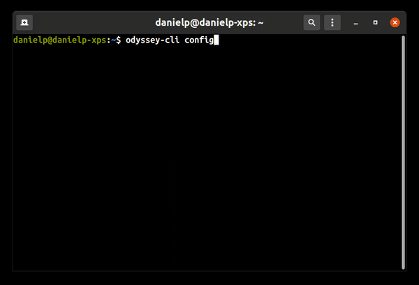
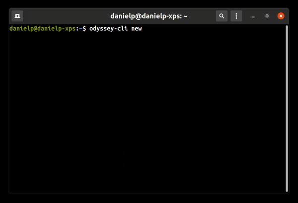

# Odyssey CLI

Welcome to Odyssey CLI, a powerful tool designed to streamline your Odyssey project setup and management. Read more about the [Odyssey Framework]() here!

This CLI application empowers developers to:
- Quickly configure project-dependent settings like Terraform backend state and AWS region
- Create new Odyssey projects with a single command

Whether you're starting a new API, website, Odyssey CLI significantly reduces setup time and ensures best practices are followed from the outset.

Get started with AWS cloud solutions, CI/CD, and Infrastructure as Code effortlessly!

# Table of Contents

1. [Installation](#installation)
   - [MacOS and Linux](#macos-and-linux)
   - [Windows](#windows)
   - [Verifying the Installation](#verifying-the-installation)
2. [Usage](#usage)
3. [Uninstallation](#uninstallation)
4. [Contributing](#contributing)
5. [License](#license)

## Installation

### MacOS and Linux

1. Download the latest release for the specific OS:
   ```bash
   curl -OLf <download-link>
   ```

   Replace `download-link` with the appropriate URL from this list:

   - Linux (i386):   https://github.com/algebananazzzzz/odyssey-cli/releases/latest/download/odyssey-cli_Linux_i386.tar.gz
   - Linux (arm64):  https://github.com/algebananazzzzz/odyssey-cli/releases/latest/download/odyssey-cli_Linux_arm64.tar.gz
   - Linux (x86_64): https://github.com/algebananazzzzz/odyssey-cli/releases/latest/download/odyssey-cli_Linux_x86_64.tar.gz
   - MacOS (arm64):  https://github.com/algebananazzzzz/odyssey-cli/releases/latest/download/odyssey-cli_Darwin_arm64.tar.gz
   - MacOS (x86_64): https://github.com/algebananazzzzz/odyssey-cli/releases/latest/download/odyssey-cli_Darwin_x86_64.tar.gz

2. Extract the binary:
   ```bash
   tar -xzvf odyssey-cli_<OS>_<ARCH>.tar.gz odyssey-cli
   ```

3. (Optional) Move the binary to a location in your PATH:
   ```bash
   sudo mv odyssey-cli /usr/local/bin/
   ```
   This step allows you to run the CLI from any directory.

### Windows

1. Download the latest release for Windows from the [releases page](https://github.com/algebananazzzzz/odyssey-cli/releases/latest).
2. Extract the ZIP file.
3. Add the directory containing `odyssey-cli.exe` to your system's PATH.

### Verifying the Installation

After installation, verify that odyssey-cli is installed correctly by running:

```bash
odyssey-cli help
```

Note: If you encounter permission issues, make the binary executable:
```bash
chmod +x odyssey-cli
```

## Usage

1. To configure the Terraform backend state configuration and the AWS region:

```bash
odyssey-cli config
```


2. To create a new Odyssey project with the configurations:

```bash
odyssey-cli new
```


3. To deploy your application, create a GitLab repository and push your local changes to trigger a CI/CD pipeline.

## Uninstallation

To uninstall odyssey-cli, remove the binary from your PATH:

  ```bash
  sudo rm /usr/local/bin/odyssey-cli
  ```

## Contributing

We love your input! We want to make contributing to this project as easy and transparent as possible, whether it's:

- Reporting a bug
- Discussing the current state of the code
- Submitting a fix
- Proposing new features

Pull requests are the best way to propose changes to the codebase. We actively welcome your pull requests:

1. Fork the repo and create your branch from `main`.
2. Make sure your code lints.
3. Document your changes and issue that pull request!

## License

This project is licensed under the MIT License. See the [LICENSE](./LICENSE) file for more details.

